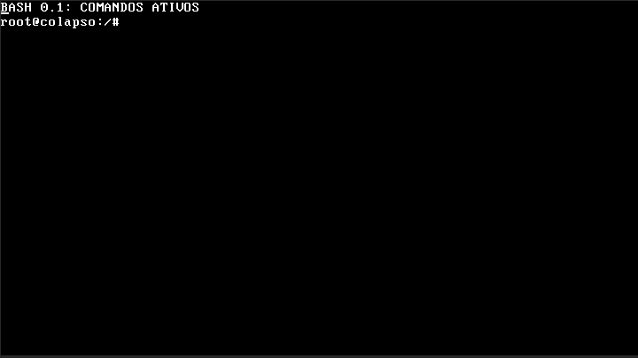

# Colapso Operating System (x86_32)

O **Colapso OS** é um sistema operacional minimalista escrito em Assembly e C, projetado para rodar na arquitetura x86 de 32 bits. Este projeto foca na compreensão profunda do hardware, gerenciamento de memória e transição entre modos de operação do processador.



## 🚀 Status Atual: Kernel Space Active
O sistema já realiza o boot completo, faz a transição para Modo Protegido e executa um Kernel em C com driver de vídeo VGA básico.

### Arquitetura de Implementação
- **Bootloader (MBR):** Localizado no Setor 1 do disco (512 bytes). Escrito em Assembly NASM (16-bit Real Mode).
- **Global Descriptor Table (GDT):** Configurada manualmente para definir segmentos de Código e Dados de 4GB, permitindo a transição para 32 bits.
- **Modo de Operação:** Protected Mode (Modo Protegido) com suporte a endereçamento de 32 bits.
- **Kernel:** Escrito em C (32-bit freestanding), linkado como um binário flat carregado em `0x1000`.
- **Vídeo:** Driver VGA direto na memória física `0xB8000` com suporte a cores (Azul/Branco).

## 📁 Estrutura do Projeto
```text
colapso/
├── docs/                 # Documentação completa do sistema
├── src/
│   ├── boot/
│   │   ├── boot.asm      # Bootloader (MBR + Transição 16->32 bit)
│   │   └── gdt.asm       # Definição da Tabela Global de Descritores
│   └── kernel/
│       ├── kernel.c      # Onde o sistema operacional "vive" (C)
│       └── kernel_entry.asm # "Ponte" entre o bootloader e a função C
├── scripts/
│   └── kernel.ld         # Script do Linker para o layout do kernel
├── build/                # Binários gerados (ignorado pelo git)
└── Makefile              # Automação de compilação e execução
```

Para mais detalhes, consulte a [**Documentação do Sistema**](docs/index.md).

## 🛠️ Requisitos
- **Compilador:** `gcc` (com suporte a `-m32`).
- **Assembler:** `nasm`.
- **Linker:** `ld` (binutils).
- **Emulador:** `qemu-system-i386`.

## 💻 Como Rodar
Para compilar e iniciar o sistema no QEMU via VNC (Display :0):
```bash
make run-vnc
```

Para encerrar o processo:
```bash
make stop
```

## 🔍 Detalhes Técnicos de Boot
1. **BIOS** carrega o `boot.bin` (512 bytes) em `0x7C00`.
2. O Bootloader lê 15 setores do disco para a RAM no endereço `0x1000` (onde está o kernel).
3. A **Linha A20** é habilitada para permitir acesso a memória acima de 1MB.
4. A **GDT** é carregada e o processador entra em **Protected Mode**.
5. O controle é passado para o `kernel_entry.asm`, que chama a função `kernel_main` em C.

---
*Desenvolvido com foco em estabilidade absoluta e controle total do hardware.*
